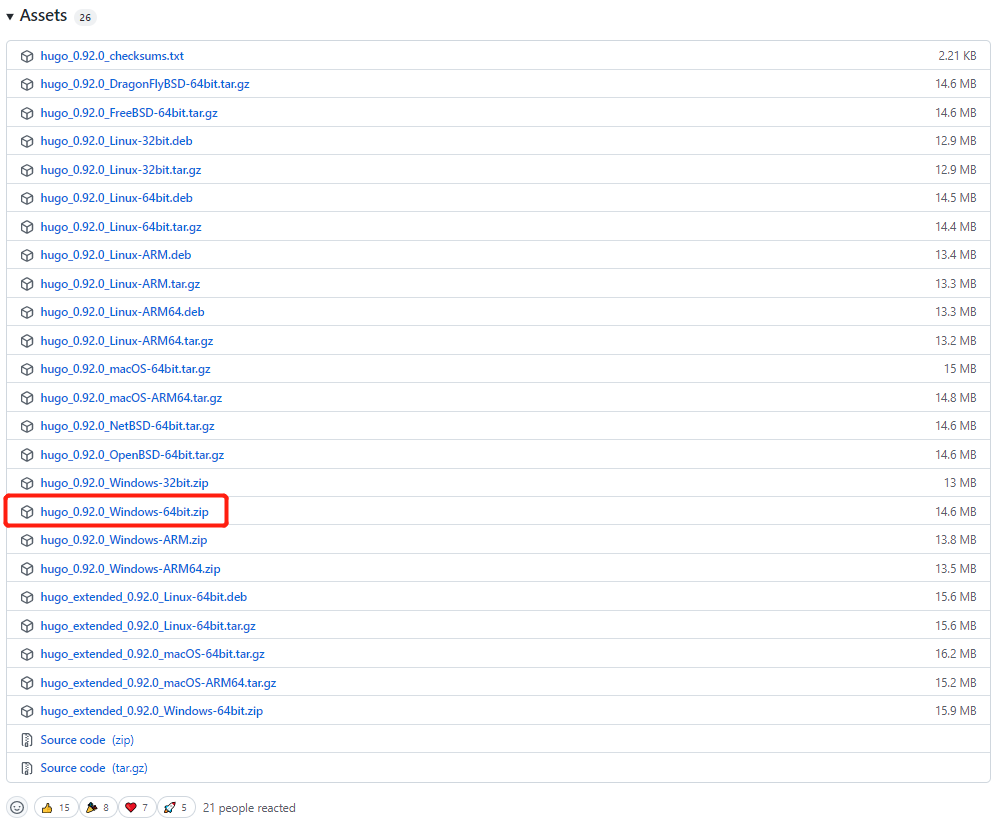
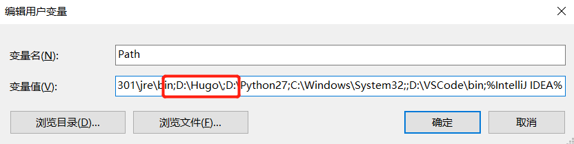

> 博客构建之路

### 一、安装Hugo

- 到[ Hugo Releases](https://github.com/gohugoio/hugo/releases)下载对应的操作系统版本的Hugo二进制文件(hugo或hugo.exe)



- 配置环境变量

  

  

### 二、生成站点

使用Hugo快速生成站点，比如希望生成到**e/Desktop/zhishouH**路径：

`$ hugo new site /e/Desktop/zhishouH`

这样就在**e/Desdktop/site**目录里生成了初始站点，进去目录：

`cd /e/Desktop/zhishouH`

站点目录：
```
|- archetypes
|- content
|- data
|- layouts
|- static
|- themes
|- config.toml
```


### 三、创建文章

创建一篇文章：

`$ hugo new post/关于hugo.md`

**index.md**生成到了**content/post/关于hugo.md**	


### 四、安装皮肤

技术型博客主题[maupassant](https://github.com/flysnow-org/maupassant-hugo)(关于更多主题介绍在github里)

`git clone https://github.com/flysnow-org/maupassant-hugo themes/maupassant`


### 五、运行Hugo

在站点根目录执行`hugo server`命令进行调试

浏览器里打开 ` http://localhost:1313/`


### 六、部署到GitHub pages

首先在GitHub上创建一个Repository，命名为：`coderzh.github.io` （coderzh替换为github用户名）

在站点根目录执行 `Hugo` 命令生成最终页面：

`$ hugo --theme=maupassant --baseUrl="http://coderzh.github.io/"`


### 参考文章

- [Hugo中文文档](https://www.gohugo.org/)
- [github怎么绑定自己的域名？](https://www.zhihu.com/question/31377141/answer/384465402)
- [hugo博客使用 utterances 作为评论系统](https://cloud.tencent.com/developer/article/1834230)
