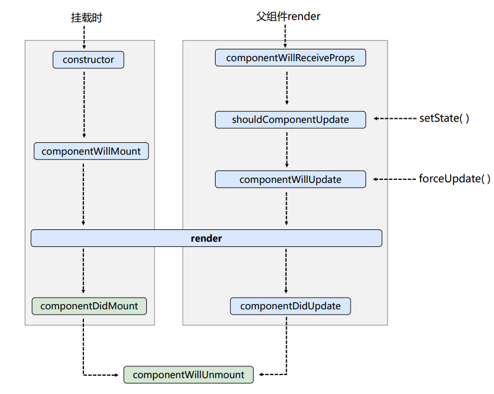

> React 生命周期函数

#### 1、生命周期函数(旧)

```jsx
class Count extends React.Component {
  // 构造器
  constructor(props) {
    console.log("Count--constructor");
    super(props)
    // 初始化状态
    this.state = { count: 0 }
  }

  // +1按钮的回调 
  add = () => {
    // 获取原状态
    const { count } = this.state
    // 更新状态
    this.setState({ count: count + 1 })
  }

  // 卸载组件按钮的回调
  death = () => {
    ReactDOM.unmountComponentAtNode(document.getElementById('app'))
  }

  // 强制更新按钮的回调
  force = () => {
    this.forceUpdate()
  }
  
  // 组件将要挂载的钩子
  componentWillMount() {
    console.log("Count--componentWillMount");
  }

  // 组件挂载完毕的钩子
  componentDidMount() {
    console.log("Count--componentDidMount");
  }

  // 组件将要卸载的钩子
  componentWillUnmount() {
    console.log("Count--componentWillUnmount");
  }

  // 控制组件更新的阀门 
  shouldComponentUpdate() {
    console.log("Count--shouldComponentUpdate");
    return true
  }

  // 组件将要更新的钩子
  componentWillUpdate() {
    console.log("Count--componentWillUpdate");
  }

  // 组件更新完的钩子
  componentDidUpdate() {
    console.log("Count--componentDidUpdate");
  }

  render() {
    console.log("Count--render");
    const { count } = this.state
    return (
      <div>
        <h2>当前求和为：{count}</h2>
		<button onClick={this.add}>+1</button>
		<button onClick={this.death}>卸载组件</button>
		<button onClick={this.force}>强制更新</button>
	  </div>
    )
  }
}

// 父组件A
class A extends React.Component {
  state = { carName: '奔驰' }

  changeCar = () => {
    this.setState({ carName: '本田' })
  }
  
  render() {
    return (
	  <div>
		<div>我是A组件</div>
		<button onClick={this.changeCar}>换车</button>
		<B carName={this.state.carName} />
	  </div>
	)
  }
}

// 子组件B
class B extends React.Component {
  // 组件就要接受新的props的钩子
  componentWillReceiveProps(props) {
    console.log("B--componentWillReceiveProps", props);
  }
  // 控制组件更新的阀门
  shouldComponentUpdate() {
	console.log("B--shouldComponentUpdate");
	return true
  }
  // 组件将要更新的钩子
  componentWillUpdate() {
	console.log("B--componentWillUpdate");
  }
  // 组件更新完毕的钩子
  componentDidUpdate() {
	console.log("B--componentDidUpdate");
  }
  render() {
	return (
	  <div>我是B组件,接收到的车是:{this.props.carName}</div>
	)
  }
}

// ReactDOM.render(<Count />, document.getElementById('app'))
ReactDOM.render(<A />, document.getElementById('app'))
```

示例代码：[生命周期函数(旧)](https://github.com/zhishouH/learn-react/blob/main/react-basic/10-%E7%BB%84%E4%BB%B6%E7%94%9F%E5%91%BD%E5%91%A8%E6%9C%9F/2-react%E7%94%9F%E5%91%BD%E5%91%A8%E6%9C%9F(%E6%97%A7).html)



- 初始化阶段：由ReactDOM.render( )触发--->初次渲染  

  - constructor( ) 

  - componentWillMount( ) 

  - render( )

  - componentDidMount( )    ====>    常用

    一般在这个钩子中做初始化的操作，例如：开启定时器、发送网络请求、订阅消息  

- 更新阶段:由组件内部this.setState( )或父组件render触发

  - shouldComponentUpdate( ) 

  - componentWillUpdate( ) 
  - render( )    ====>    必须使用的钩子
  - componentDidUpdate( ) 

- 卸载组件：由ReactDOM.unmountComponentAtNode( )触发

  - componentWillUnmount( )    ====>    组件将要卸载的钩子(常用)

    一般在这个钩子中做收尾的操作，例如：关闭定时器，取消订阅消息

#### 2、生命周期函数(新)