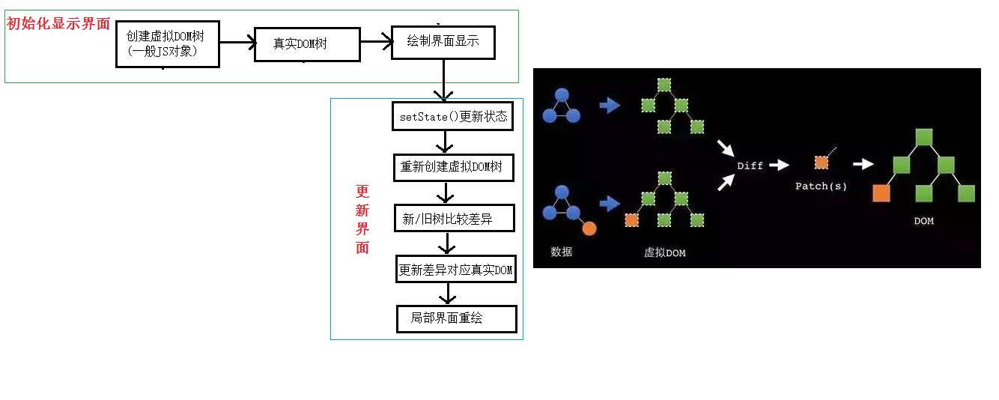

> React key的作用

```jsx
// 使用index索引值作为key
// 初始数据：
{id:1,name:'小张',age:18},
{id:2,name:'小李',age:19}
    
// 初始的虚拟DOM：
<li key=0>小张---18<input type="text"/></li>
<li key=1>小李---19<input type="text"/></li>

// 更新后的数据：
{id:3,name:'小王',age:20},
{id:1,name:'小张',age:18},
{id:2,name:'小李',age:19}

// 更新数据后的虚拟DOM：
<li key=0>小王---20<input type="text"/></li>
<li key=1>小张---18<input type="text"/></li>
<li key=2>小李---19<input type="text"/></li>
```

```jsx
// 使用id唯一标识作为key
// 初始数据：
{id:1,name:'小张',age:18},
{id:2,name:'小李',age:19}

// 初始的虚拟DOM：
<li key=1>小张---18<input type="text"/></li>
<li key=2>小李---19<input type="text"/></li>

// 更新后的数据：
{id:3,name:'小王',age:20},
{id:1,name:'小张',age:18},
{id:2,name:'小李',age:19},
// 更新数据后的虚拟DOM：
<li key=3>小王---20<input type="text"/></li>
<li key=1>小张---18<input type="text"/></li>
<li key=2>小李---19<input type="text"/></li>
```


#### 1、虚拟DOM中key的作用

- 简单地说：key是虚拟DOM对象的标识，在更新显示是key起着极其重要的作用

- 详细地说：当状态中的数据发生变化时，react会根据【新数据】生成【新的虚拟DOM】，随后React会进行【新虚拟DOM】与【旧虚拟DOM】的diff比较，比较规则如下：

  - 旧虚拟DOM中找到了与新虚拟DOM相同的key:

    (1). 若虚拟DOM中内容没变，直接使用之前的真实DOM

    (2). 若虚拟DOM中内容变了，则生成新的真实DOM，随后替换掉页面中之前的真实DOM

  - 旧虚拟DOM中未找到与新虚拟DOM相同的key:

    根据数据创建新的真实DOM，随后渲染到页面

#### 2、用index作为key可能会引发的问题

- 若对数据进行：逆序添加、逆序删除等破坏顺序操作：

  ​	会产生没有必要的真实DOM更新  ==>   界面效果没问题，但效率低

- 如果结构中包含输入类的DOM(input)：

  会产生错误的DOM更新  ==>  界面有问题

- !注意：如果不存在对数据的逆序添加、逆序删除等破坏顺序操作

  仅用于渲染列表用于展示，使用index作为key是没有问题的

#### 3、如何选择key?

- 最好使用每条数据的唯一标识作为key,比如id
- 如果确定只是简单的数据展示，用index是可以的


#### 基本原理图

