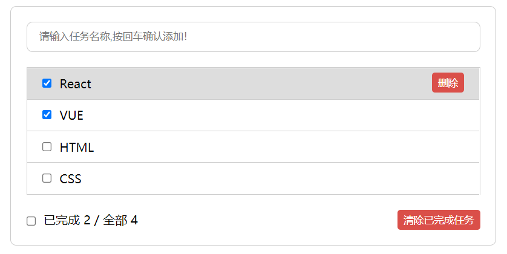

> 用 create-react-app 编写 todo-list

#### 示例效果

#### 项目结构

```jsx
|- src
  |- components
  	|- Header
  	|- List
  	  |- Item
  	|- Footer
  |- App.jsx
  |- index.js
```

[示例代码](https://github.com/zhishouH/learn-react/tree/main/todo-list)

#### 总结：

- 1、拆分组件、实现静态组件，注意className、style的写法

- 2、动态初始化列表，如何确定将数据放在哪个组件的state中

	- 1）某个组件使用，放在其自身的sate中

	- 2）某些组件使用，放在它们共同的父组件state中(官方称此操作为：状态提升)

- 3、关于父子组件之间如何通信
	- 1）【父组件】给【子组件】传递数据：通过props传递
	
	- 2）【子组件】给【父组件】传递数据：通过props传递，要求父提前给子传递一个函数

- 4、状态在哪里，操作状态的方法就放在哪里