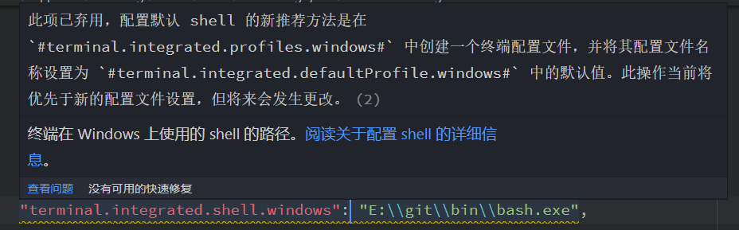
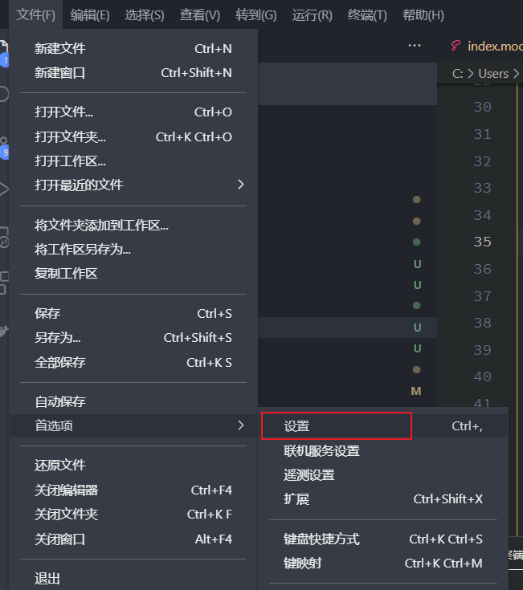
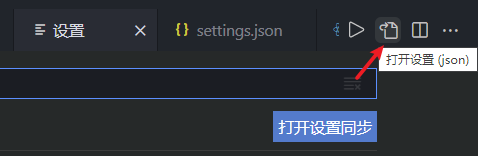
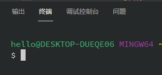

> 在windows下，vscode 1.60.0版本修改默认终端为git bash

在windows下，更新了1.60.0版本的vscode后，原有的修改默认终端的配置失效了。



下面为您展示如何在新版本的vscode中修改默认的终端为git bash:

## 一、找到settings.json配置文件





## 二、添加配置

将下面的配置添加到`settings.json`中，注意git bash路径更改为您自己的。

```json
"terminal.integrated.profiles.windows": {
    "Git-Bash": {
        "path": "E:\\git\\bin\\bash.exe",
        "args": []
    }
},
"terminal.integrated.defaultProfile.windows": "Git-Bash"
```

## 三、重启vscode

在您修改保存完配置后，重新启动vscode，即会自动选择git bash终端。



------

**转载于：**[https://www.huangweiliang.com/post/windows%E4%B8%8Bvscode-1.60.0%E7%89%88%E6%9C%AC%E4%BF%AE%E6%94%B9%E9%BB%98%E8%AE%A4%E7%BB%88%E7%AB%AF%E4%B8%BAgit-bash.html](https://www.huangweiliang.com/post/windows下vscode-1.60.0版本修改默认终端为git-bash.html)

